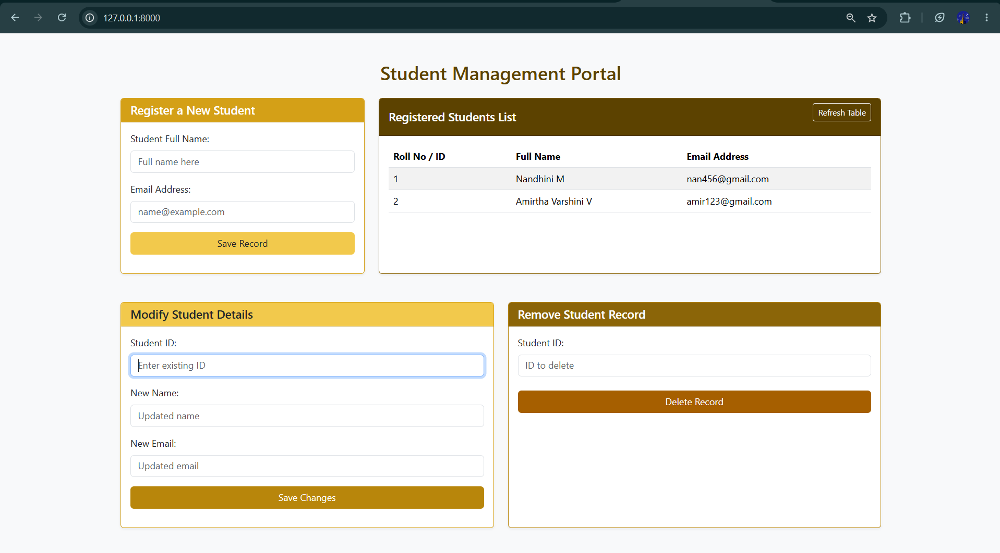
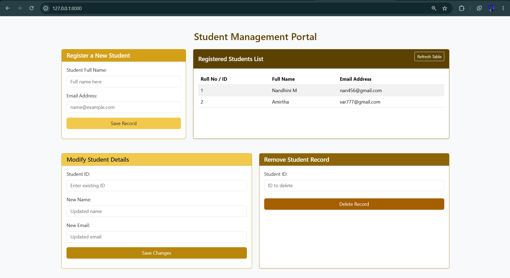
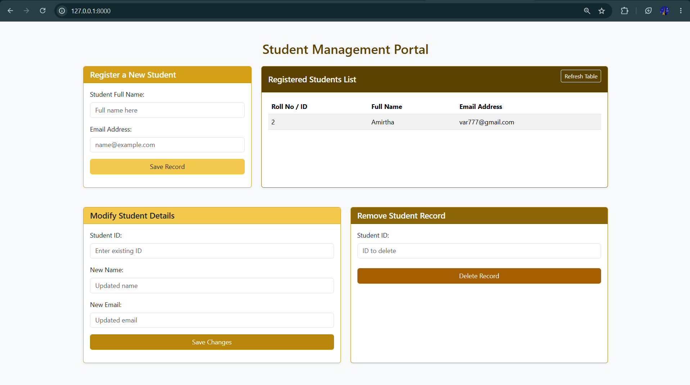

# Project : CRUD Application Development using Bootstrap & Django
## Date : 
## AIM

To develop a Django-based CRUD web application using Bootstrap to perform Create, Read, Update, and Delete operations on student records.

## ALGORITHM

1. Create a Django project and application.
2. Define the `Student` model with required fields such as Name and Email.
3. Configure the SQLite database and run migrations.
4. Configure URL routing for Home, Add, Update, and Delete operations.
5. Create the Home view to retrieve and display student records.
6. Create the Add view to insert new student records into the database.
7. Create the Update view to modify existing student records.
8. Create the Delete view to remove student records from the database.
9. Design the web pages using Bootstrap with forms, tables, and responsive buttons.
10. Run the Django server and test all CRUD operations through the web browser.

## PROGRAM

html:
```


<html>
<head>
    <meta charset="UTF-8">
    <meta name="viewport" content="width=device-width, initial-scale=1.0">
    <title>Student Management Portal</title>
    <link href="https://cdn.jsdelivr.net/npm/bootstrap@5.3.2/dist/css/bootstrap.min.css" rel="stylesheet">
</head>
<body class="bg-light">

    <div class="container my-5">
        <h2 class="text-center mb-4" style="color:#5C4200;">Student Management Portal</h2>

        
        <div class="row mb-4">
            
            <div class="col-lg-4 mb-4">
                <div class="card shadow-sm h-100" style="border-color:#D4A017;">
                    <div class="card-header text-white" style="background-color:#D4A017;">
                        <h5 class="mb-0">Register a New Student</h5>
                    </div>
                    <div class="card-body">
                        <form action="/create/" method="POST">
                            

                            <div class="mb-3">
                                <label class="form-label">Student Full Name:</label>
                                <input type="text" class="form-control" name="name" placeholder="Full name here" required>
                            </div>

                            <div class="mb-3">
                                <label class="form-label">Email Address:</label>
                                <input type="email" class="form-control" name="email" placeholder="name@example.com" required>
                            </div>

                            <div class="d-grid">
                                <button type="submit" class="btn text-dark" style="background-color:#F2C94C;">Save Record</button>
                            </div>
                        </form>
                    </div>
                </div>
            </div>

            
            <div class="col-lg-8 mb-4">
                <div class="card shadow-sm h-100" style="border-color:#8B6508;">
                    <div class="card-header text-white d-flex justify-content-between align-items-center" style="background-color:#5C4200;">
                        <h5 class="mb-0">Registered Students List</h5>
                        <form action="" method="GET" class="d-inline">
                            <button type="submit" class="btn btn-sm btn-outline-light">Refresh Table</button>
                        </form>
                    </div>
                    <div class="card-body">
                        <div class="table-responsive">
                            <table class="table table-striped table-hover align-middle">
                                <thead style="background-color:#F2C94C;">
                                    <tr>
                                        <th>Roll No / ID</th>
                                        <th>Full Name</th>
                                        <th>Email Address</th>
                                    </tr>
                                </thead>
                                <tbody>
                                    
                                    <tr>
                                        <td>{{ i.Idno }}</td>
                                        <td>{{ i.Name }}</td>
                                        <td>{{ i.Email }}</td>
                                    </tr>
                                    
                                    <tr>
                                        <td colspan="3" class="text-center text-muted">No student records found.</td>
                                    </tr>
                                    
                                </tbody>
                            </table>
                        </div>
                    </div>
                </div>
            </div>
        </div>

        
        <div class="row">
            <!-- Modify Card -->
            <div class="col-lg-6 mb-4">
                <div class="card shadow-sm h-100" style="border-color:#D4A017;">
                    <div class="card-header text-dark" style="background-color:#F2C94C;">
                        <h5 class="mb-0">Modify Student Details</h5>
                    </div>
                    <div class="card-body">
                        <form action="" method="POST">
                            

                            <div class="mb-3">
                                <label class="form-label">Student ID:</label>
                                <input type="text" class="form-control" name="id" placeholder="Enter existing ID" required>
                            </div>

                            <div class="mb-3">
                                <label class="form-label">New Name:</label>
                                <input type="text" class="form-control" name="name" placeholder="Updated name" required>
                            </div>

                            <div class="mb-3">
                                <label class="form-label">New Email:</label>
                                <input type="email" class="form-control" name="email" placeholder="Updated email" required>
                            </div>

                            <div class="d-grid">
                                <button type="submit" class="btn text-white" style="background-color:#B8860B;">Save Changes</button>
                            </div>
                        </form>
                    </div>
                </div>
            </div>

           
            <div class="col-lg-6 mb-4">
                <div class="card shadow-sm h-100" style="border-color:#B8860B;">
                    <div class="card-header text-white" style="background-color:#8B6508;">
                        <h5 class="mb-0">Remove Student Record</h5>
                    </div>
                    <div class="card-body d-flex flex-column justify-content-between">
                        <form action="" method="POST">
                            

                            <div class="mb-3">
                                <label class="form-label">Student ID:</label>
                                <input type="text" class="form-control" name="id" placeholder="ID to delete" required>
                            </div>

                            <div class="d-grid mt-4">
                                <button type="submit" class="btn text-white" style="background-color:#A65F00;" onclick="return confirm('Are you sure you want to delete this record?');">Delete Record</button>
                            </div>
                        </form>
                    </div>
                </div>
            </div>
        </div>

    </div>

    
    <script src="https://cdn.jsdelivr.net/npm/bootstrap@5.3.2/dist/js/bootstrap.bundle.min.js"></script>
</body>
</html>
```

models.py:
```
from django.db import models
from django.contrib import admin

class Student(models.Model):
    Idno = models.AutoField(primary_key=True)
    Name = models.CharField(max_length=100)
    Email = models.EmailField(unique=True)

class StudentAdmin(admin.ModelAdmin):
    list_display = ['Idno','Name','Email']
```

views.py:
```
from django.shortcuts import render, redirect
from .models import Student


def home(request):
    result = Student.objects.all()
    return render(request, 'form.html', {'result': result})


def create(request):
    if request.method == "POST":
        name = request.POST.get("name")
        email = request.POST.get("email")

        Student.objects.create(
            Name=name,
            Email=email
        )

    return redirect("home")


def update(request):
    if request.method == "POST":
        idd = request.POST.get("id")

        student = Student.objects.get(Idno=idd)

        student.Name = request.POST.get("name")
        student.Email = request.POST.get("email")

        student.save()

    return redirect("home")


def delete(request):
    if request.method == "POST":
        idd = request.POST.get("id")

        Student.objects.get(Idno=idd).delete()

    return redirect("home")
```

urls.py:
```
from django.contrib import admin
from django.urls import path
from app import views

urlpatterns = [
    path('admin/', admin.site.urls),
    path('', views.home, name='home'),
    path('create/', views.create, name='create'),
    path('update/', views.update, name='up'),
    path('delete/', views.delete, name='del'),
]

```

## OUTPUT







## RESULT

A Django-based CRUD web application was successfully developed using Bootstrap to perform Create, Read, Update, and Delete operations on student records with SQLite as the backend database.
